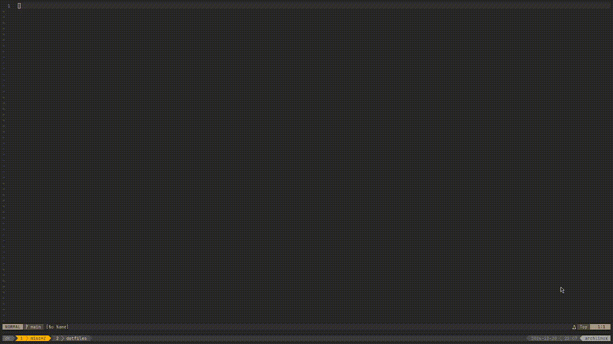

# cht-telescope
use cht.sh with nvim-telescope

### Disclaimer
This is a personal project, very much a WIP.


## Installation
via [lazy.nvim](https://github.com/folke/lazy.nvim)
```lua
{
  "zmoney20/cht-telescope",
  dependencies = { "nvim-telescope/telescope.nvim" },
  config = function()
    require("cht-telescope").setup({
      -- options
      -- debounce = 100,
    })
  end
}
```
Or, just add it as a dependency for telescope if you've already got that installed. Example:
```lua
{
  {
    "nvim-telescope/telescope.nvim",
      branch = "0.1.x",
      dependencies = {
        "nvim-lua/plenary.nvim",
	"zmoney20/cht-telescope",
      },
    lazy = true,
...
```

## Usage
```lua
vim.keymap.set("n", "<leader>sc", require("cht-telescope").search_cht_sh, { desc = "[S]earch [C]heat Sheet" })
```
